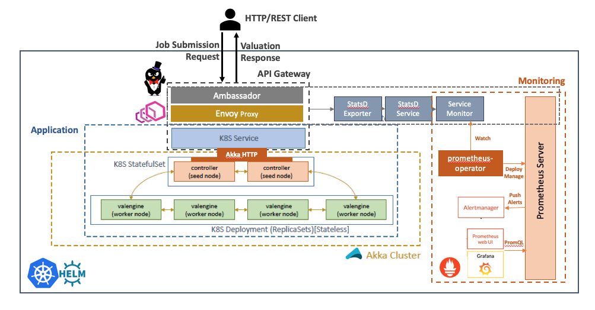

# hwx-pe-k8s-akka

A P2P cluster based architectural variation of [hwx-pricing-engine](https://github.com/amolthacker/hwx-pricing-engine)(`hwxpe`) leveraging [Akka Cluster](https://doc.akka.io/docs/akka/current/common/cluster.html) and [Akka HTTP](https://doc.akka.io/docs/akka-http/current/introduction.html) on [K8s](https://kubernetes.io/).
See the [Cloudera Community article](https://community.cloudera.com/t5/Community-Articles/Flexing-your-Compute-Muscle-with-Kubernetes-Part-2-2/ta-p/249405) for more details.

## Architecture

### Application

The distributed compute engine leverages the Akka Cluster framework to designate a pair of seed nodes as the `controller (ve-ctrl)` which:
 * Act as contact points for the `valengine (ve)` worker nodes to join the cluster
 * Expose RESTful service (using Akka HTTP) for job submission from an HTTP client
 * Dispatch jobs to the registered `ve` workers
 
The `ve` workers process individual or batch (job) valuation requests from the `controller` nodes by doing a static 
pricing compute leveraging the [QuantLib](https://www.quantlib.org/) library through a [Java wrapper](https://github.com/amolthacker/hwx-pricing-engine/tree/master/compute/src/main/java/com/hwx/pe/valengine/spark) - `computelib`


### Infrastructure

The application is containerized using Docker and the containers managed and orchestrated with Kubernetes levegraging [Google Kubernetes Engine(GKE)](https://cloud.google.com/kubernetes-engine/) as follows:


 * The `controller (ve-ctrl)` seed nodes are deployed as [`StatefulSets`](https://kubernetes.io/docs/concepts/workloads/controllers/statefulset/) as these need to be a ordered set of nodes that are stable from a networking point of view (consistent addressable DNS name across pod rescheduling)
 * The `valengine (ve)` workers are a natural fit for [`Deployment`](https://kubernetes.io/docs/concepts/workloads/controllers/deployment/) decorated with semantics for autoscaling in parallel (as against sequentially as is the case with StatefulSets) based on compute load
 * The `controller` pods are front by a K8s [`Service`](https://kubernetes.io/docs/concepts/services-networking/service/) exposing the REST API to submit compute jobs

The `Service` is augmented by K8s native API gateway in the form of [Ambassador](https://www.getambassador.io/) - an open source distribution of [Envoy](https://www.envoyproxy.io/) an L7 proxy among other things. 
Envoy facilitates the service data plane (service specific service discovery, health checking, routing, load balancing, authentication/authorization, and observability) and Ambassador provides the service control plane (policy, configuration, co-ordination of multiple stateless isolated dataplanes and their abstraction as a singular distributed system). Here Ambassador also provides the implementation of K8s [Ingress](https://kubernetes.io/docs/concepts/services-networking/ingress/) abstraction to provide external load balanced access to the `Service`

Finally, the application compute cluster (Akka) and service mesh (Ambassador and Envoy) is monitored with [Prometheus](https://prometheus.io/) deployed through the [Prometheus Operator](https://github.com/coreos/prometheus-operator)



## Tech Stack

```
Kubernetes (GKE) 1.10
Helm 2.11
Prometheus 2.6
Envoy 1.8
Ambassador 0.40.2
Akka 2.x
```


## Deployment

### Prerequisites

 * GCP access with Compute and Kubernetes Engine and [`gcloud`](https://cloud.google.com/sdk/gcloud/) client setup
 * [`kubectl`](https://kubernetes.io/docs/reference/kubectl/overview/)
 * [`helm`](https://helm.sh/)
 
### Setup

 1. Clone this repo
 
 2. Update `scripts/env.sh` with GCP Region and Zone details

 3. Bootstrap the infrastructure in GKE
 ```
 $ ./scripts/setup-cluster.sh
 ```

#### Setup Tasks (Automated)
 The script above automates the following steps:

  a. Enables GCP Compute and Container APIs

  b. Create a GKE cluster with auto-scaling enabled
  ```
  $ gcloud container clusters create ${CLUSTER_NAME} \
      --preemptible \
      --zone ${GCLOUD_ZONE} \
      --scopes cloud-platform \
      --enable-autoscaling --min-nodes 2 --max-nodes 6 \
      --num-nodes 2
  ```

  c. Configure `kubectl` and [setup `helm`]()
  ```
  $ gcloud container clusters get-credentials ${CLUSTER_NAME} --zone ${GCLOUD_ZONE}
  $ kubectl create clusterrolebinding ambassador --clusterrole=cluster-admin --user=${CLUSTER_ADMIN} --serviceaccount=default:ambassador
  ```

  d. Deploy the application using Helm and enable autoscaling
  ```
  $ helm install --name hwxpe helm/hwxpe
  $ kubectl autoscale deployment ve --cpu-percent=50 --min=2 --max=6
  ```
  This uses the pre-built image [`amolthacker/ce-akka`](https://cloud.docker.com/u/amolthacker/repository/docker/amolthacker/ce-akka)

  Optionally, one can rebuild the application with `Maven`
  ```
  $ mvn clean package
  ```
  and use the new image regenerated as part of the build leveraging the [`docker-maven-plugin`](https://github.com/spotify/docker-maven-plugin)
  To build the application w/o generating Docker image:
  ```
  $ mvn clean package -DskipDocker
  ```

  e. Deploy the `Prometheus` infrastructure (incl. AlertManager, Grafana)
  ```
  helm install stable/prometheus-operator --name prometheus-operator --namespace monitoring
  ```

  f. Deploy `Envoy` via `Ambassador` and configure `Ambassador`-`Prometheus` integration
  ```
  $ kubectl apply -f k8s/ambassador/ambassador.yaml
  $ kubectl apply -f k8s/ambassador/ambassador-svc.yaml
  $ kubectl apply -f k8s/ambassador/ambassador-monitor.yaml
  $ kubectl apply -f k8s/prometheus/prometheus.yaml
  ```

  g. Expose the application's K8s `Service` externally via `Ambassador(Envoy)` proxy
  ```
  $ kubectl apply -f k8s/ambassador/ambassador-ve-svc.yaml
  ```

  h. Forward Ports for
   * `Prometheus` [9090]
   * `AlertManager` [9093]
   * `Grafana` [3000]
   * `Ambassador` [8877]

  i. Display the application service external-ip

### Teardown

```
$ ./scripts/teardown-cluster.sh
```
 
## Job Submission

```
$ ./scripts/submit-compute-batch --compute-svc <external-ip> --num-jobs <num-jobs>
```
